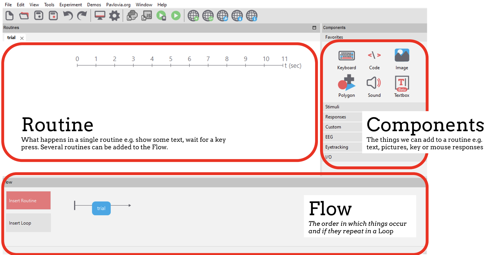
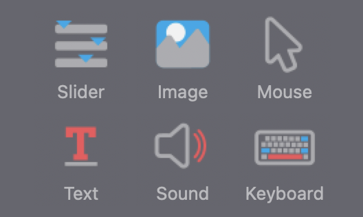
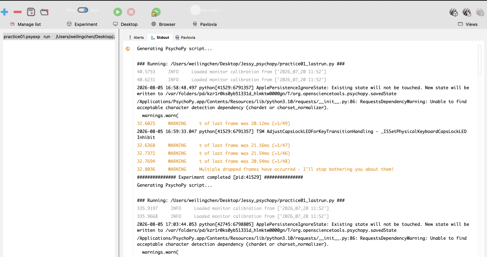
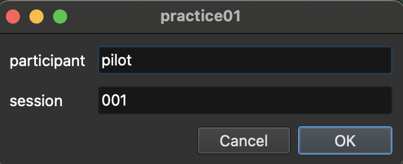

# 第一階段：完成純句子判斷核心

**任務 1–4**

第一階段目標：

```text
單一 trial
→ Excel 條件表
→ 自動呈現不同句子
→ 自動判定正確率
```

完成後會得到一個可獨立運作的「純句子判斷小實驗」，能夠：

1. 顯示 fixation `+`
2. 顯示英文句子
3. 接受 `f` 或 `j` 按鍵
4. 記錄反應鍵與 reaction time
5. 從 Excel 依序讀取四個不同句子
6. 比較受試者按鍵與正確答案
7. 在 CSV 中記錄每題答對或答錯

---

## 開始之前：認識 PsychoPy

### Builder

**Builder** 是 PsychoPy 提供的「不用寫程式」視覺化介面，開啟 PsychoPy 後預設會看到它：

- 整個實驗是用一個個 **Routine**（例如 `trial`）組成
- 每個 Routine 裡再放入不同的 **component**（文字、聲音、鍵盤反應等）
- 畫面下方的 **Flow** 決定 Routine 的執行順序與重複次數（例如加上 Loop 重複讀取 Excel 的每一列）

[](assets/builder_terms.png){: .screenshot-link target="_blank" }

在 Builder 右側的 Components 面板中，你會看到很多圖示，例如：

[](assets/comp.png){: .screenshot-link target="_blank" }

簡單說明每一個的功能：

| Component | 功能 |
|---|---|
| **Slider** | 呈現一條可拖曳的量表（例如 Likert scale），讓受試者用滑鼠評分或評等。 |
| **Image** | 在畫面上顯示圖片檔案（例如 `.png`、`.jpg`）。 |
| **Mouse** | 記錄滑鼠點擊位置、點擊時間，或判斷是否點在特定區域內。 |
| **Text** | 在畫面上顯示文字，例如指導語、fixation `+`、句子或單字。 |
| **Sound** | 播放音檔（例如 `.wav`），可設定音量、開始/結束時間。 |
| **Keyboard** | 接收並記錄受試者的按鍵反應與 reaction time。 |

!!! tip "這份手冊只會用到三個：Text、Sound、Keyboard"
    - **Text**：顯示 fixation 與逐字呈現的句子（第一階段就會用到）
    - **Keyboard**：接收 `f/j` 反應並記錄 RT（第一階段就會用到）
    - **Sound**：播放五和弦音檔（第二階段才會用到）

    Slider、Image、Mouse 目前用不到，先不用理會，之後若實驗設計有變動再另外說明。

### Runner

**Runner** 是 PsychoPy 用來實際執行實驗、顯示執行紀錄的視窗。在 Builder 按下綠色播放鍵後，PsychoPy 會自動切換到 Runner 畫面並開始執行。

[](assets/runner.png){: .screenshot-link target="_blank" }

- 上方的 **Pilot / Run** 切換開關：決定用哪種模式執行
- **Desktop**：在本機視窗中執行實驗（這份手冊主要使用這個）
- **Browser**／**Pavlovia**：透過瀏覽器或線上平台執行，目前不會用到
- 下方的 **Stdout** 分頁：顯示實驗執行過程的完整記錄，包含警告訊息（例如 dropped frames）以及最後是否出現 `Experiment completed`

## 任務 1：建立最小單一 trial

### 目標

先建立一個能顯示 fixation、顯示固定句子、接受 `f/j`，並記錄反應時間的最小實驗。

### 1. 建立並儲存 Builder 實驗

1. 開啟 PsychoPy。
2. 確認目前在 **Builder** 畫面。
3. 建立新實驗。
4. 儲存為：

    ```text
    practice01.psyexp
    ```

5. 放進 `Jessy_psychopy` 資料夾。

??? bug "遇到問題：之後找不到條件表"
    從一開始就把 `.psyexp` 放進正式專案資料夾。
    後面的 `conditions_test.xlsx` 也要放在相同位置，避免相對路徑錯誤。

### 2. 加入 fixation

在 `trial` Routine 中加入一個 **Text** component。

| 欄位 | 內容 |
|---|---|
| Name | `fixation` |
| Start | `0.0` |
| Stop / Duration | `0.5` |
| Text | `+` |

完成後按 **OK**。

### 3. 加入句子文字

再加入一個 **Text** component。

| 欄位 | 內容 |
|---|---|
| Name | `sentence_text` |
| Start | `0.5` |
| Stop / Duration | 留白 |
| Text | `The angry man often punches.` |
| Update | `constant` |

完成後按 **OK**。

!!! warning "重要：Name 必須使用 `sentence_text`"
    後面的 Excel 會有一個欄位叫做 `sentence`，因此 Text component **不可以**也命名為 `sentence`。

    錯誤命名：

    ```text
    Text component = sentence
    Excel column = sentence
    ```

    正確命名：

    ```text
    Text component = sentence_text
    Excel column = sentence
    ```

    若兩者同名，執行時可能不會顯示英文句子，而是顯示一大串：

    ```text
    TextStim(...)
    ```

### 4. 加入鍵盤反應

加入一個 **Keyboard** component。

**Basic**

| 欄位 | 內容 |
|---|---|
| Name | `sentence_response` |
| Start | `0.5` |
| Stop / Duration | 留白 |
| Allowed keys | `'f','j'` |
| Force end of Routine | 勾選 |

**Data**

| 欄位 | 內容 |
|---|---|
| Store | `first key` |
| Store correct | 暫時不要勾 |
| Save onset/offset times | 保持勾選 |
| Sync timing with screen | 保持勾選 |
| Discard previous | 保持勾選 |

完成後按 **OK**，再儲存實驗。

??? bug "遇到問題：按了其他鍵也有反應"
    檢查 `Allowed keys` 是否正確輸入：

    ```text
    'f','j'
    ```

    並確認 `Force end of Routine` 已勾選。

### 5. 第一次執行：先確認 Run 模式

在 Builder 上方確認開關位於 `Run`（不要使用 `Pilot`），再點 Desktop 區域的綠色播放鍵。

按下播放鍵後，PsychoPy 會先跳出一個小視窗，要求填寫：

[](assets/pilot.png){: .screenshot-link target="_blank" }

- **participant**：受試者代號。測試階段可以固定填 `pilot`；正式收案時再改成每位受試者的編號（例如 `S01`），不要留空。
- **session**：第幾次測試/收案。同一個 participant 重複測試時，建議每次遞增（`001`、`002`…），方便之後在 `data/` 資料夾分辨是哪一次跑的資料，避免混淆或覆蓋。

這兩個欄位最後都會被寫進輸出的檔名與 CSV 裡的 `participant`、`session` 欄位。

Participant 視窗可輸入：

| 欄位 | 內容 |
|---|---|
| participant | `pilot` |
| session | `001` |

執行後應依序看到：

1. `+`
2. 固定句子
3. 按 `f` 或 `j`
4. 實驗結束

??? bug "遇到問題：畫面顯示元件資訊或測試文字"
    原因通常是目前位於 `Pilot` 模式。

    1. 按 `Esc` 回到 Builder。
    2. 將上方開關切到 `Run`。
    3. 再按綠色播放鍵。

### 6. macOS 鍵盤權限

第一次執行時，macOS 可能出現：

```text
PsychHID disabled due to macOS security restrictions
```

這不是 Builder 設定錯誤，而是 macOS 阻止 PsychoPy 讀取鍵盤。

??? bug "處理方式：開啟輸入監控權限"
    1. 完整關閉 PsychoPy。
    2. 開啟：

        ```text
        系統設定 → 隱私權與安全性 → 輸入監控
        ```

    3. 找到 PsychoPy。
    4. 將 PsychoPy 開關關掉，再重新打開。
    5. 若系統要求 Touch ID 或密碼，確認允許。
    6. 關閉系統設定。
    7. 重新啟動 PsychoPy。

    **注意：** 修改權限後必須重新啟動 PsychoPy，否則新的權限可能尚未生效。

### 7. 判斷是否正常完成

Runner 視窗最後若顯示：

```text
Experiment completed
```

代表實驗已正常結束。

??? bug "遇到橘色 dropped frames warning"
    若最後仍有 `Experiment completed`，目前任務 1 可先視為成功。
    dropped frames 之後在正式 timing 階段仍要檢查，但不影響現在測試鍵盤與句子功能。

### 8. 檢查資料檔

開啟 `Jessy_psychopy/data/`，找到最新的 `.csv`，確認包含：

```text
sentence_response.keys
sentence_response.rt
```

例如：

| sentence_response.keys | sentence_response.rt |
|---|---:|
| j | 3.358 |

代表受試者按了 `j`，並在句子出現後約 3.36 秒作答。

??? bug "遇到問題：資料夾裡檔案太多，不知道開哪一個"
    PsychoPy 可能同時產生 `.csv`、`.log`、`.psydat`。

    在 Finder 按 `Command + 2` 切換成列表顯示，再依「修改日期」找最新的 `.csv`。
    不要開 `.log` 或 `.psydat` 來檢查表格資料。

---

## 任務 2：建立四個測試句子的條件表

### 目標

建立一份小型 Excel 條件表，供 PsychoPy 讀取四個句子。

### 1. 建立欄位

開啟 Excel 或 Numbers，在第一列輸入：

| A1 | B1 | C1 |
|---|---|---|
| `trial_id` | `sentence` | `sentence_type` |

注意：

- 欄位名稱不要有空格。
- `trial_id` 和 `sentence_type` 使用英文小寫。
- `sentence` 必須和後面 `$sentence` 的拼法完全一致。
- PsychoPy 的 Text component 必須維持 `sentence_text`。

??? bug "遇到問題：之後 PsychoPy 找不到變數"
    最常見原因是欄位名稱拼法不一致，例如：

    ```text
    Sentence
    sentence text
    sentence_type 
    ```

    建議直接使用：

    ```text
    trial_id
    sentence
    sentence_type
    ```

### 2. 輸入四列測試資料

| trial_id | sentence | sentence_type |
|---|---|---|
| S01-C | The angry man often punches. | C |
| S01-V | The angry man often punch. | V |
| S02-C | The angry men often punch. | C |
| S02-V | The angry men often punches. | V |

其中：`C` = correct sentence，`V` = syntactic violation。

### 3. 儲存條件表

儲存或匯出為 `conditions_test.xlsx`，並與 `practice01.psyexp` 放在同一資料夾。

??? bug "遇到問題：檔案看起來是 Excel，但 PsychoPy 讀不到"
    檢查：

    1. 副檔名確實是 `.xlsx`。
    2. 不是 Numbers 原生格式。
    3. 沒有儲存成 `conditions_test.xlsx.xlsx`。
    4. 檔案與 `practice01.psyexp` 位於同一資料夾。

---

## 任務 3：讓 PsychoPy 自動讀取不同句子

### 目標

讓 `trial` Routine 重複四次，並依序讀取 Excel 的四列資料。

### 1. 建立 Loop

在 Builder 下方的 **Flow** 區域：

1. 點 `Insert Loop`。
2. 點 `trial` 左側的位置作為 Loop 起點。
3. 點 `trial` 右側的位置作為 Loop 終點。
4. 開啟 Loop Properties。

先建立空 Loop：

| 欄位 | 內容 |
|---|---|
| Name | `trials` |
| Loop type | `sequential` |
| Is trials | 勾選 |
| Num. repeats | `1` |
| Conditions | 先留白 |

先按 **OK** 建立 Loop。

!!! info "為什麼先建立空 Loop？"
    某些情況下，第一次建立 Loop 時直接加入條件表，視窗可能暫時顯示找不到檔案。
    先完成空 Loop，再重新開啟加入 Conditions，通常較穩定。

### 2. 加入條件表

在 Flow 中雙擊灰色的 `trials`，設定：

| 欄位 | 內容 |
|---|---|
| Conditions | `conditions_test.xlsx` |

成功讀取後，視窗下方應顯示：

```text
4 conditions, with 3 parameters
[trial_id, sentence, sentence_type]
```

確認無誤後按 **OK**。

??? bug "遇到紅字：No file named conditions_test.xlsx"
    依序檢查：

    1. `.psyexp` 與 `.xlsx` 是否在同一資料夾。
    2. 點 Conditions 右側的資料夾圖示重新選取檔案。
    3. 不要只手動輸入檔名。
    4. 確認 Excel 已儲存。

    若檔案內容似乎已被讀到，但紅字仍不消失：

    1. 清空 Conditions。
    2. 按 **OK**。
    3. 重新開啟 `trials Properties`。
    4. 再透過資料夾圖示選取檔案。

### 3. 把固定句子改成條件表變數

雙擊 Text component `sentence_text`，設定：

| 欄位 | 內容 |
|---|---|
| Name | `sentence_text` |
| Text | `$sentence` |
| Update | `set every repeat` |

注意：

- `$sentence` 必須與 Excel 欄位 `sentence` 完全一致。
- `$` 表示這是變數，不是固定文字。
- Update 必須是 `set every repeat`。

完成後按 **OK**，再儲存實驗。

??? bug "遇到紅色提示：變數應該更新"
    若 Update 仍為 `constant`，請改成 `set every repeat`。
    否則每一個 trial 可能不會更新為新的句子。

### 4. 測試四個句子

確認 Builder 上方為 `Run`，再點 Desktop 的綠色播放鍵。

Participant 視窗可輸入（`session` 建議每次測試都遞增，方便區分資料）：

| 欄位 | 內容 |
|---|---|
| participant | `pilot` |
| session | `004` |

測試時應依序出現：

1. The angry man often punches.
2. The angry man often punch.
3. The angry men often punch.
4. The angry men often punches.

每看到一句就按 `f` 或 `j`。

??? bug "遇到問題：顯示一大串 TextStim(...)"
    回到 Builder，雙擊句子的 Text component，確認：

    ```text
    Name = sentence_text
    Text = $sentence
    ```

    不能是 `Name = sentence`，因為元件名稱 `sentence` 會與 Excel 欄位 `sentence` 衝突。

??? bug "遇到問題：只看到測試資訊，不是句子"
    檢查上方是否仍在 `Pilot`，並切換成 `Run`。

### 5. 檢查輸出資料

開啟最新的 `.csv`，確認有四列資料，並包含：

```text
trial_id
sentence
sentence_type
sentence_response.keys
sentence_response.rt
```

??? bug "遇到問題：看起來只有三列"
    先確認是否只是畫面沒有向下捲到底。第四列應為 `S02-V`。
    若確實只有三列，再確認實驗是否在第四題前被按 `Esc` 中止。

---

## 任務 4：加入正確答案並自動記錄正確率

### 目標

讓 PsychoPy 不只記錄受試者按了哪一個鍵，也能自動判斷每一題是否答對。

本實驗採用固定按鍵對應：

```text
F = Incorrect
J = Correct
```

可將 `F` 聯想到 False，也可以用左右位置記憶：左側 F：Incorrect，右側 J：Correct。

### 1. 在條件表新增正確答案欄位

開啟 `conditions_test.xlsx`，在第 4 欄加入 `correctAns`。

完整條件表：

| trial_id | sentence | sentence_type | correctAns |
|---|---|---|---|
| S01-C | The angry man often punches. | C | j |
| S01-V | The angry man often punch. | V | f |
| S02-C | The angry men often punch. | C | j |
| S02-V | The angry men often punches. | V | f |

規則：

- `C` 句為正確句，因此正確按鍵是 `j`
- `V` 句為違反句，因此正確按鍵是 `f`
- `f`、`j` 使用小寫
- 欄位名稱 `correctAns` 的大小寫必須完全一致

儲存後，關閉 Excel 或 Numbers。

!!! info "為什麼要關閉 Excel／Numbers？"
    PsychoPy 有時仍會保留先前讀取的舊版條件表。
    關閉試算表程式後，再讓 Loop 重新讀取，可避免只看到舊的 3 parameters。

### 2. 讓 Loop 重新讀取條件表

雙擊 Flow 中灰色的 `trials`，確認下方顯示：

```text
4 conditions, with 4 parameters
[trial_id, sentence, sentence_type, correctAns]
```

只有看到 `4 parameters` 才能進入下一步。

??? bug "遇到問題：仍然只有 3 parameters"
    代表 PsychoPy 尚未重新載入新增的 `correctAns`。可以先試試看：

    - 點 Conditions 欄位右側的**綠色箭頭**（重新整理／reload 圖示），嘗試直接重新讀取一次條件表。

    如果綠色箭頭沒有用，再依序處理：

    1. 確認 Excel／Numbers 已儲存並關閉。
    2. 關閉再重新開啟 `trials Properties`。
    3. 點 Conditions 右側的資料夾圖示。
    4. 重新選取 `conditions_test.xlsx`。
    5. 確認最後出現 `correctAns`。

### 3. 設定 Keyboard component

雙擊 `sentence_response`，進入 **Data** 分頁，設定：

| 欄位 | 設定 |
|---|---|
| Store | `first key` |
| Store correct | 勾選 |
| Correct answer | `$correctAns` |
| Save onset/offset times | 勾選 |
| Sync timing with screen | 勾選 |
| Discard previous | 勾選 |

完成後按 **OK**，再儲存實驗。

??? bug "遇到紅色提示：correctAns should be set to update"
    PsychoPy 2026.1.x 中，`Correct answer` 欄位可能持續顯示：

    ```text
    Looks like your variable 'correctAns' in 'Correct answer'
    should be set to update.
    ```

    這個欄位沒有另外可選的 update 選單，因此不要只用這條紅色提示判定失敗。

    先確認 Loop 已顯示 `4 conditions, with 4 parameters [trial_id, sentence, sentence_type, correctAns]`，
    最後再以 CSV 中的 `sentence_response.corr` 驗證功能。

### 4. 設計可驗證正確與錯誤的測試

不要四題都故意答對，否則無法確認 `0` 是否能正常產生。

建議測試：

| 題目 | 正確答案 | 測試按鍵 | 預期 corr |
|---|---|---|---:|
| S01-C | j | j | 1 |
| S01-V | f | f | 1 |
| S02-C | j | f | 0 |
| S02-V | f | j | 0 |

Participant 視窗可輸入（`session` 記得遞增，跟前面幾次測試分開）：

```text
participant = pilot
session = 005
```

依序按：

```text
j
f
f
j
```

### 5. 檢查 CSV 的正確率

開啟最新的 `.csv`，確認以下欄位：

```text
trial_id
sentence
sentence_type
correctAns
sentence_response.keys
sentence_response.corr
sentence_response.rt
```

正確結果：

| trial_id | correctAns | sentence_response.keys | sentence_response.corr |
|---|---|---|---:|
| S01-C | j | j | 1 |
| S01-V | f | f | 1 |
| S02-C | j | f | 0 |
| S02-V | f | j | 0 |

其中 `1` = 答對，`0` = 答錯。

??? bug "遇到問題：找不到剛剛的 CSV"
    1. 在 Finder 按 `Command + 2`，切換成列表顯示。
    2. 依「修改日期」排序。
    3. 找最接近剛才測試時間的 `.csv`。
    4. 不要選 `.log` 或 `.psydat`。

??? bug "遇到問題：corr 全部是空白"
    檢查：

    1. `Store correct` 是否已勾選。
    2. `Correct answer` 是否為 `$correctAns`。
    3. Loop 是否顯示 4 parameters。
    4. Excel 中 `correctAns` 是否確實填入小寫 `f` 或 `j`。

??? bug "遇到問題：corr 與預期相反"
    檢查按鍵規則是否一致：

    ```text
    f = Incorrect
    j = Correct
    ```

    因此：`C → j`，`V → f`。

---

## 第一階段完成檢查表

- [ ] 任務 1：建立最小單一 trial
- [ ] 任務 2：建立四個測試句子的條件表
- [ ] 任務 3：讓 PsychoPy 自動讀取不同句子
- [ ] 任務 4：讓 PsychoPy 自動記錄正確率

完成第一階段後，實驗已能：

- 顯示 fixation
- 從 Excel 讀取不同句子
- 接受 `f/j`
- 記錄按鍵
- 記錄 reaction time
- 自動判定正確率
- 將條件與反應寫入 CSV

➡️ 接下來進入 [第二階段：加入音樂與正式時間安排](stage2.md)。
