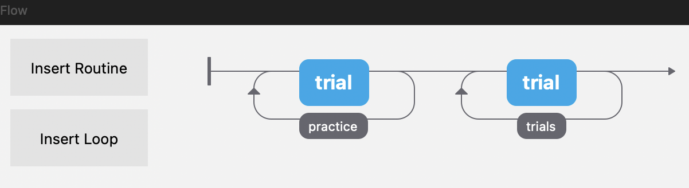

# 第四階段：完成受試者實際看到的實驗

**任務 12–18**

第四階段把第三階段完成的正式 48-trial 實驗本體，包成完整的受試者流程：

```text
Instructions
→ Practice（4 trials）
→ Formal Start
→ Formal Part 1（24 trials）
→ Break
→ Formal Part 2（24 trials）
→ End
```

本階段包含：

- [x] 任務 12：建立 Practice trials
- [x] 任務 13：加入 Instructions
- [x] 任務 14：建立 Practice → Formal experiment 轉場
- [x] 任務 15：加入中途休息
- [x] 任務 16：設定 Participant information
- [x] 任務 17：加入實驗結束畫面
- [x] 任務 18：完整 end-to-end 測試

---

## 任務 12：建立 Practice trials

### 1. 建立 conditions_practice.xlsx

Practice 不放進 `conditions_final.xlsx`，而是另外建立 `conditions_practice.xlsx`，和 `.psyexp`、正式條件表放在同一層：

```text
Jessy_psychopy/
├── practice01.psyexp
├── conditions_final.xlsx
├── conditions_practice.xlsx
└── audio/
    ├── M01-R.wav
    ├── M01-I.wav
    ├── ...
    ├── M12-R.wav
    ├── M12-I.wav
    ├── P01-R.wav
    └── P01-I.wav
```

Practice 條件表使用和正式版完全相同的 13 欄：

| A | B | C | D | E | F | G | H | I | J | K | L | M |
|---|---|---|---|---|---|---|---|---|---|---|---|---|
| `trial_id` | `item_id` | `sentence` | `sentence_type` | `correctAns` | `music_type` | `music_pair` | `audio_file` | `word1` | `word2` | `word3` | `word4` | `word5` |

### 2. 填入 4 個 Practice trials

Practice 使用兩組句子，各有 C/V 兩版，共 4 trials，音檔統一使用 `P01`：

| `trial_id` | `item_id` | `sentence` | `sentence_type` | `correctAns` | `music_type` | `music_pair` | `audio_file` | `word1` | `word2` | `word3` | `word4` | `word5` |
|---|---|---|---|---|---|---|---|---|---|---|---|---|
| PS01-C | PS01 | The noisy lady often screams. | C | j | R | P01 | `audio/P01-R.wav` | The | noisy | lady | often | screams. |
| PS01-V | PS01 | The noisy lady often scream. | V | f | I | P01 | `audio/P01-I.wav` | The | noisy | lady | often | scream. |
| PS02-C | PS02 | The slimy worms often wiggle. | C | j | I | P01 | `audio/P01-I.wav` | The | slimy | worms | often | wiggle. |
| PS02-V | PS02 | The slimy worms often wiggles. | V | f | R | P01 | `audio/P01-R.wav` | The | slimy | worms | often | wiggles. |

Practice 的四種條件各出現一次：

| 條件 | 數量 |
|---|---:|
| C + R | 1 |
| C + I | 1 |
| V + R | 1 |
| V + I | 1 |

### 3. 在 Flow 中加入 Practice routine

在正式 `trials` loop 前面，再插入一次原本已經設定好的 `trial` Routine。

!!! warning "不要重新建立新的 trial routine"
    在 Flow 中插入既有的 `trial` Routine，不要重新建立一個新的。這樣才能沿用已經設定好的 fixation、五個 words、音樂、keyboard、RT、accuracy、timing。

Flow 概念上會先變成：

```text
trial → formal trials
```

左邊新增的 `trial` 將作為 Practice 使用。

### 4. 建立 practice Loop

用新的 Loop 包住 Practice 用的 `trial` routine：

| 欄位 | 設定 |
|---|---|
| Name | `practice` |
| Loop type | `sequential` |
| Num. repeats | `1` |
| Conditions | `conditions_practice.xlsx` |
| Selected rows | 空白 |
| Random seed | 空白 |

完成後 Flow 應該看起來像這樣，`practice` 與 `trials` 分別各自包住一個 `trial` Routine：

[](assets/practice.png){: .screenshot-link target="_blank" }

成功載入後應看到：

```text
4 conditions, with 13 parameters
```

Flow 概念上應為：

```text
practice loop → formal trials loop
```

### 5. 測試 Practice

Run 時可填 `participant = test04`、`session = 001`，確認：

- [x] PS01-C → P01-R
- [x] PS01-V → P01-I
- [x] PS02-C → P01-I
- [x] PS02-V → P01-R
- [x] 500 ms fixation 正常
- [x] 五個 words 正常呈現
- [x] `word5` 有句點
- [x] P01 音檔正常播放
- [x] word/chord 同步正常
- [x] 第五個 onset 後可以按 `f`/`j`
- [x] RT 正常
- [x] accuracy 正常
- [x] Practice 結束後能順利接到正式 trials

### 6. 確認 Practice 資料

打開測試 CSV，確認可用 `trial_id` 找到 `PS01-C`、`PS01-V`、`PS02-C`、`PS02-V`，且這些列都有 response、RT、correct/incorrect、`music_type`、`music_pair = P01`。

---

## 任務 13：加入 Instructions

### 1. 建立 instructions Routine

在 Flow 最前面、`practice` loop 前面新增 `instructions`。

1. 在 Flow 最左邊，找到 `practice` loop 的左邊界。
2. 點 `practice` loop 前面那一小段水平線。
3. 選 `Insert Routine`。
4. 選 `New`。
5. 名稱輸入：

    ```text
    instructions
    ```

Flow 概念上變成：

```text
instructions → practice → formal trials
```

### 2. 加入 Text component

| 欄位 | 設定 |
|---|---|
| Name | `instruction_text` |
| Start | `0` |
| Stop / Duration | 留白 |

Text 內容：

> You will see English sentences presented one word at a time while listening to music.
>
> Please decide whether each sentence is grammatically correct.
>
> Press **F** if the sentence is incorrect.
> Press **J** if the sentence is correct.
>
> Please respond as quickly and accurately as possible.
>
> Press SPACE to begin the practice trials.

### 3. 加入 Keyboard component

| 欄位 | 設定 |
|---|---|
| Name | `instruction_key` |
| Allowed keys | `space` |
| Start | `0` |
| Force end of Routine | 勾選 |
| Store | `nothing` |

這樣 Instructions 會一直留在畫面上，直到受試者按 Space。

### 4. 測試 Instructions

Run 時可填 `participant = test05`、`session = 001`，確認：

- [x] Instructions 最先出現
- [x] 畫面不會自動跳走
- [x] 其他按鍵不會進入下一頁
- [x] 按 Space 才進入 Practice
- [x] Practice 可正常開始

---

## 任務 14：建立 Practice → Formal experiment 轉場

### 1. 新增 formal_start Routine

在 `practice` loop 後面、正式 trials 前面新增 `formal_start`。

要把 `formal_start` 放在中間，請這樣做：

1. 在 Flow 裡找到 `practice` loop 的右邊界。
2. 再找到正式 trials loop 的左邊界。
3. 點兩個 loop 中間那一小段水平線。
4. 點 `Insert Routine`。
5. 選 `New`。
6. Routine 名稱輸入：

    ```text
    formal_start
    ```

新增成功後，Flow 應該變成：

```text
practice loop → formal_start → formal trials loop
```

### 2. 加入 Text component

| 欄位 | 設定 |
|---|---|
| Name | `formal_start_text` |
| Start | `0` |
| Stop / Duration | 留白 |

Text 內容：

> Practice is complete.
>
> The formal experiment will now begin.
>
> Please continue to respond as quickly and accurately as possible.
>
> Press SPACE when you are ready to begin.

### 3. 加入 Keyboard component

| 欄位 | 設定 |
|---|---|
| Name | `formal_start_key` |
| Allowed keys | `space` |
| Start | `0` |
| Force end of Routine | 勾選 |
| Store | `nothing` |

### 4. 測試 Practice → Formal 轉場

Run 時可填 `participant = test06`、`session = 001`，確認流程：

1. instructions
2. Space
3. 4 個 Practice trials
4. `formal_start`
5. Space
6. 第一個 formal trial

第一個正式 trial 應為 `S20-C`，音檔為 `M10-I.wav`。

---

## 任務 15：加入中途休息

正式 48 trials 分成：

```text
前 24 trials → Break → 後 24 trials
```

### 1. 建立前後兩份正式條件表

保留原本的 `conditions_final.xlsx`，另外建立 `conditions_final_part1.xlsx`、`conditions_final_part2.xlsx`：

| 檔案 | 內容 | 第一題 | 最後一題 |
|---|---|---|---|
| `conditions_final_part1.xlsx` | 標題列 + 第 1–24 個 formal trials | S20-C | S12-V |
| `conditions_final_part2.xlsx` | 標題列 + 第 25–48 個 formal trials | S03-V | S08-V |

因此 Break 應位於：

```text
S12-V → Break → S03-V
```

### 2. 設定 formal_part1

把原本正式 `trials` Loop 改成：

| 欄位 | 設定 |
|---|---|
| Name | `formal_part1` |
| Conditions | `conditions_final_part1.xlsx` |
| Loop type | `sequential` |
| Num. repeats | `1` |
| Selected rows | 空白 |
| Random seed | 空白 |

成功載入後應看到 24 conditions、13 parameters。

### 3. 新增 break_screen

在 `formal_part1` 後面新增 Routine `break_screen`。

**Text component**

| 欄位 | 設定 |
|---|---|
| Name | `break_text` |
| Start | `0` |
| Stop / Duration | 留白 |

Text 內容：

> You may take a short break now.
>
> Press SPACE when you are ready to continue.

**Keyboard component**

| 欄位 | 設定 |
|---|---|
| Name | `break_key` |
| Allowed keys | `space` |
| Start | `0` |
| Force end of Routine | 勾選 |
| Store | `nothing` |

### 4. 建立 formal_part2

在 `break_screen` 後面再插入一次原本的 `trial` Routine，用新的 Loop 包住它：

| 欄位 | 設定 |
|---|---|
| Name | `formal_part2` |
| Loop type | `sequential` |
| Num. repeats | `1` |
| Conditions | `conditions_final_part2.xlsx` |
| Selected rows | 空白 |
| Random seed | 空白 |

成功載入後應看到 24 conditions、13 parameters。

### 5. 確認切點

| 檔案 | 第一題 | 最後一題 | Trial 數 |
|---|---|---|---:|
| `conditions_final_part1.xlsx` | S20-C | S12-V | 24 |
| `conditions_final_part2.xlsx` | S03-V | S08-V | 24 |

Break 必須出現在 `S12-V → Break → S03-V`。

### 6. 快速測試 Break

為了不用跑完前 24 題，可以暫時設定：

| Loop | Selected rows |
|---|---|
| `formal_part1` | `23` |
| `formal_part2` | `0` |

Run 時可填 `participant = test07`、`session = 001`，確認流程為：

```text
Practice → Formal Start → S12-V → Break → S03-V
```

Break 應：

- [x] 不會自己消失
- [x] 按 Space 才繼續
- [x] Break 後正常進入 S03-V

!!! warning "測試完成後記得清空 Selected rows"
    `formal_part1`、`formal_part2` 的 `Selected rows` 都要清空，恢復成空白，否則之後只會跑到剛才指定的那一列。

---

## 任務 16：設定 Participant Information

### 1. 打開 Experiment Settings

進入 **Experiment Settings → Basic**，確認 **Show info dlg** 有勾選。

### 2. 設定 Experiment Info

建議至少保留 `participant`、`session`、`age`、`musical_training_years`、`instrument`：

| 欄位 | 範例 |
|---|---|
| participant | P001 |
| session | 001 |
| age | 16 |
| musical_training_years | 6 |
| instrument | piano |

!!! info "不建議手動填 group"
    之後可根據 `musical_training_years` 統一分類，不需要另外手動填寫 `group` 欄位。

### 3. 測試 Participant Information

Run 時可填 `participant = test08`、`session = 001`、`age = 16`、`musical_training_years = 6`、`instrument = piano`，進到第一個畫面後即可 `Esc`。

打開輸出資料，確認 `participant`、`session`、`age`、`musical_training_years`、`instrument` 都有被記錄。

---

## 任務 17：加入實驗結束畫面

### 1. 新增 end_screen

在 `formal_part2` 後面新增 `end_screen`。

### 2. 加入 Text component

| 欄位 | 設定 |
|---|---|
| Name | `end_text` |
| Start | `0` |
| Stop / Duration | 留白 |

Text 內容：

> The experiment is complete.
>
> Thank you for your participation.
>
> Please inform the researcher that you have finished.
>
> Press SPACE to exit.

### 3. 加入 Keyboard component

| 欄位 | 設定 |
|---|---|
| Name | `end_key` |
| Allowed keys | `space` |
| Start | `0` |
| Force end of Routine | 勾選 |
| Store | `nothing` |

---

## 任務 18：完整 End-to-End 測試

### 1. 確認所有 Loop 設定恢復正式狀態

| Loop | Conditions | Conditions 數 | Loop type | Num. repeats | Selected rows | Random seed |
|---|---|---:|---|---|---|---|
| Practice | `conditions_practice.xlsx` | 4 | `sequential` | `1` | 空白 | 空白 |
| Formal Part 1 | `conditions_final_part1.xlsx` | 24 | `sequential` | `1` | 空白 | 空白 |
| Formal Part 2 | `conditions_final_part2.xlsx` | 24 | `sequential` | `1` | 空白 | 空白 |

### 2. 確認完整 Flow

最終 Flow 應為：

```text
instructions
↓
practice（4 trials）
↓
formal_start
↓
formal_part1（24 trials）
↓
break_screen
↓
formal_part2（24 trials）
↓
end_screen
```

### 3. 完整 Run

使用測試 ID `participant = test09`、`session = 001`，其他 participant information 填測試值即可。這一次從頭做到尾，不要中途 `Esc`。

### 4. 完整流程檢查

**Instructions**

- [x] 一開始正常出現
- [x] F = Incorrect
- [x] J = Correct
- [x] 按 Space 才開始

**Practice**

- [x] 共 4 trials
- [x] P01-R / P01-I 音檔正常
- [x] PS01 / PS02 句子正常
- [x] fixation 正常
- [x] word/chord 同步正常
- [x] RT 從第五個 onset 開始
- [x] f/j 正常
- [x] accuracy 正常

**Formal Start**

- [x] Practice 後有正式開始提示
- [x] 按 Space 才進入正式實驗

**Formal Part 1**

- [x] 共 24 trials
- [x] 第一題 = `S20-C`
- [x] 最後一題 = `S12-V`
- [x] 沒有 error

**Break**

- [x] 第 24 題後出現
- [x] 不會自己跳走
- [x] 按 Space 才繼續

**Formal Part 2**

- [x] 第一題 = `S03-V`
- [x] 最後一題 = `S08-V`
- [x] 共 24 trials
- [x] 沒有漏題
- [x] 沒有重複題

**End**

- [x] 最後有完成畫面
- [x] 按 Space 正常結束

### 5. 最後檢查 CSV

**Participant information**：確認有 `participant`、`session`、`age`、`musical_training_years`、`instrument`。

**Practice**：用 `trial_id` 應可找到 `PS01-C`、`PS01-V`、`PS02-C`、`PS02-V`，且 `music_pair = P01`。

**Formal trials**：正式 trials 共 48 個，第一個 = `S20-C`，第 24 個 = `S12-V`，第 25 個 = `S03-V`，最後一個 = `S08-V`。

每個 formal trial 至少應有：

```text
trial_id, item_id, sentence, sentence_type, correctAns,
music_type, music_pair, audio_file, word1–word5
```

以及 Keyboard component 的 `.keys`、`.rt`、`.corr`，並確認 PsychoPy timing 欄位也有正常寫入。

### 6. 最後確認 trial 數量

| 類型 | 數量 |
|---|---:|
| Practice | 4 |
| Formal | 48 |
| Total stimulus trials | 52 |

!!! info "分析時如何排除 Practice"
    正式分析時，Practice 可利用 `trial_id` 以 `PS` 開頭、或 `music_pair = P01` 排除。

---

## 第四階段完成檢查表

- [x] 任務 12：Practice trials
- [x] 任務 13：Instructions
- [x] 任務 14：Practice → Formal experiment 轉場
- [x] 任務 15：中途休息
- [x] 任務 16：Participant information
- [x] 任務 17：實驗結束畫面
- [x] 任務 18：完整 end-to-end 測試

完成第四階段後，整套 PsychoPy 實驗就已經可以讓正式受試者從頭到尾完成：

```text
Participant information
↓
Instructions
↓
Practice（4 trials）
↓
Formal Start
↓
Formal Part 1（24 trials）
↓
Break
↓
Formal Part 2（24 trials）
↓
End
```

第三階段已經驗證成功的正式 trial 核心設定不需要再修改：500 ms fixation、五個 words/chords 同步、第五個 word/chord onset 開始記錄 RT、`f`/`j` 判斷、accuracy、正式音檔配對、fixed pseudorandom order。

➡️ 接下來可以找同學或朋友實際跑一次，做 pilot test。
